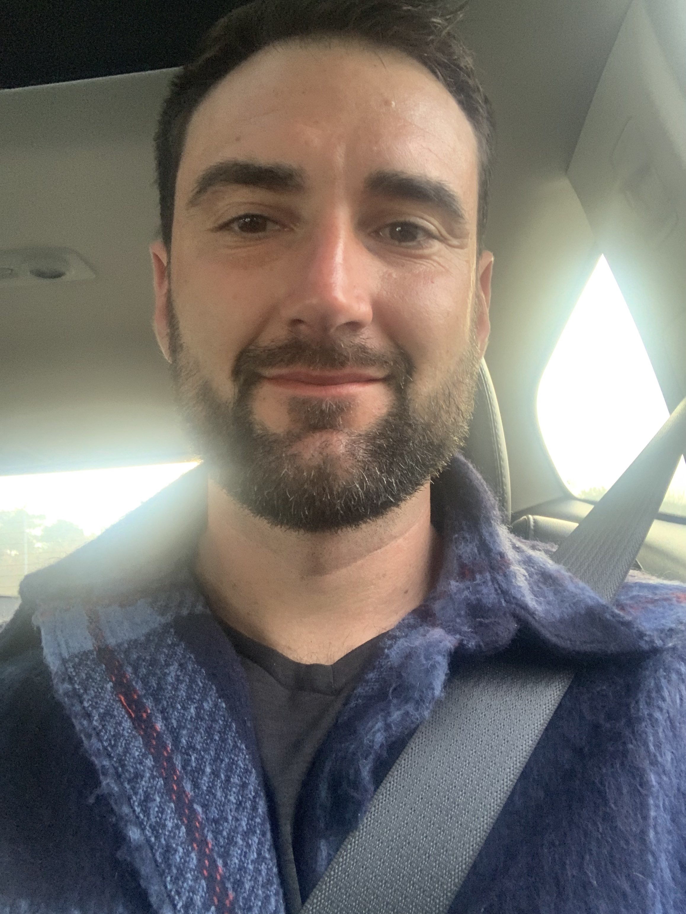
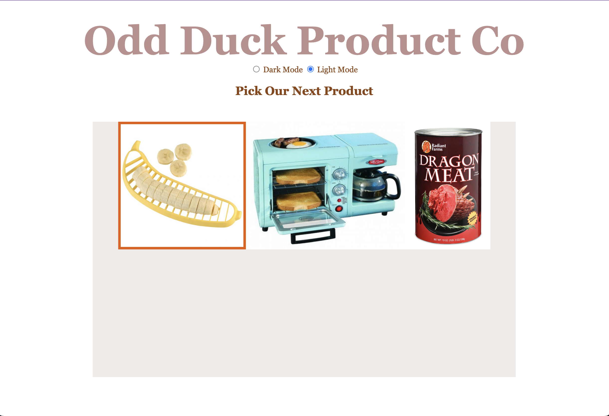

## Portfolio-prep

A two or three word catchy title. Do NOT use cliches like “programming ninja” or “coding rockstar”.
Script Sage

A personal headline, like you have atop your LinkedIn page. What do you want your career to be about?
I'm a dedicated software engineer with a passion for creating efficient and user-friendly solutions. 

Your professional pitch: You’ve done a recording, so just write down here how it goes.
Hello, my name is Chris Foster and I am a software developer with a passion for natural language processing, text analytics, and writing. My journey into tech was ignited by a desire to improve at fantasy football, and continues to burn three years later, and after a year-long walk across America where I found a passion for software development I decided to take it seriously. My ideal environment to use my skills is in a natural language processing setting where I can help educators build tools to help others learn better, or do something else with language. My previous experience in distribution provided me with the skills of organization and attention to detail that I believe will be a boost to my new career in tech.

